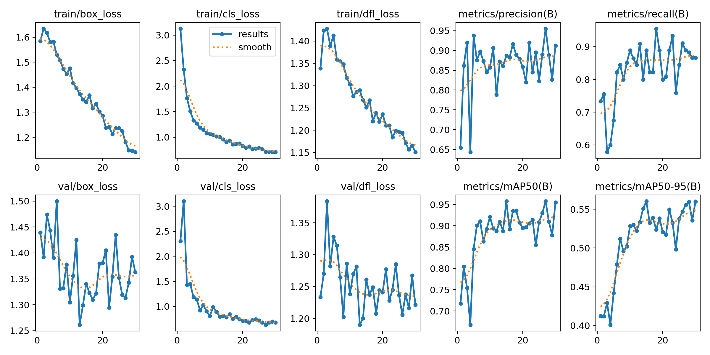
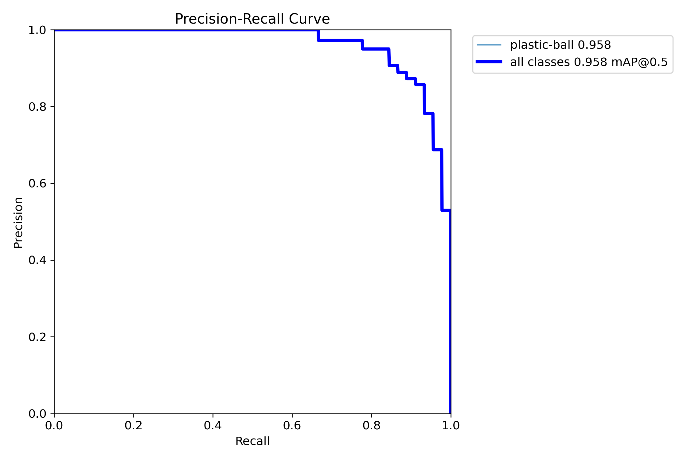
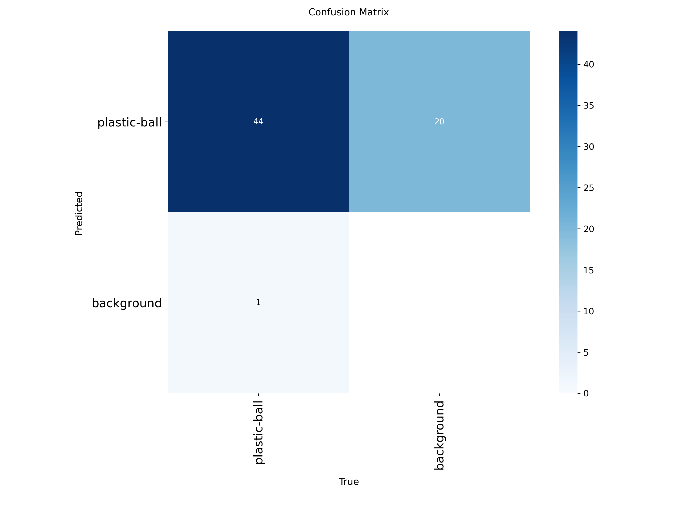
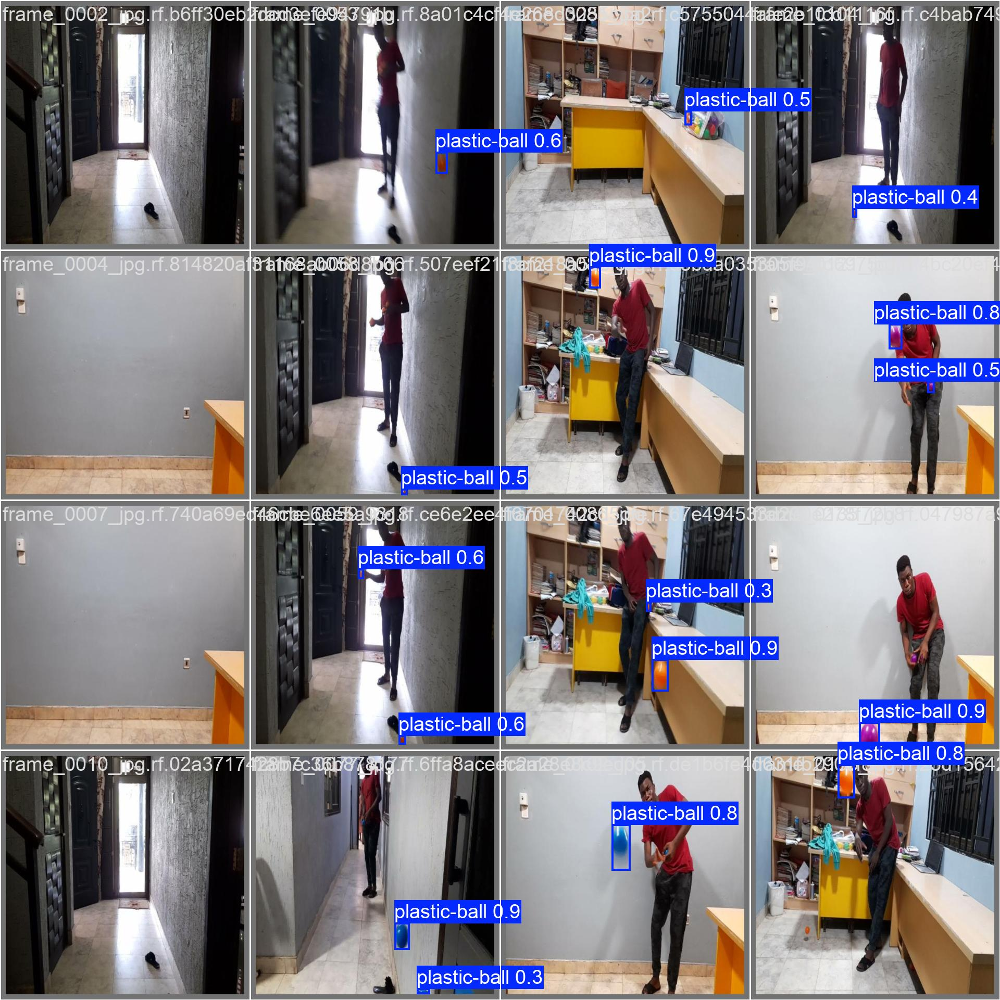

# Infinity Shield

## Objective O1 — Detection Benchmarking and Explainability: Interim Findings

MEng Final Year Project — University of Ghana

*Status: interim. All three detectors trained and analysed. Subject to revision once the dataset polygon-annotation issue is corrected for downstream work.*

---

## 1. Scope of This Document

This document records findings for Objective O1, which benchmarks lightweight object detectors for real-time plastic-projectile detection on edge hardware and applies explainable-AI (XAI) techniques to interpret their behaviour.

Three detectors have been trained and analysed: **YOLOv8n**, **MobileNet-SSD** (SSDLite320-MobileNetV3-Large), and **Faster R-CNN** with a MobileNetV3-Large FPN backbone. The third detector replaced NanoDet from the originally approved objective, due to a dependency conflict that is documented in Section 6.

All three were evaluated under a single unified COCO-style evaluation (Section 3.1) to enable direct comparison, with each detector's native evaluation pipeline also reported for transparency (Section 3.2).

---

## 2. Method

### 2.1 Dataset and Annotation

All three detectors were trained on the same plastic-ball dataset:

- Source: Roboflow project, YOLOv8 label export
- Single class: `plastic-ball`
- 80/10/10 train/valid/test split
- ~430 base images, augmented to approximately 1,200 training images (horizontal flip, brightness ±30%, blur 2px, noise 5%, 3× multiplier)
- 50 validation images, 50 test images

**Annotation convention — in-flight balls only.** Only balls in flight were annotated as positive instances. Balls held in a person's hand were intentionally left unannotated and treated as negatives, reflecting Infinity Shield's purpose: the system responds to projectiles in flight, not stationary held objects. Throughout this document, a held ball with no detection box is correct behaviour and is not counted as a missed detection. A detection box around a held ball is treated as a false positive.

**Annotation quality.** Annotations were performed by a single annotator (the author). Spot-checking confirmed that no held balls were boxed. Box tightness varied — most boxes were tight to the ball, a minority slightly oversized. No re-annotation was performed after training began, to preserve experimental consistency.

### 2.2 Dataset Limitation — Polygon Annotations

A known dataset-quality limitation should be disclosed: approximately 50 training images and 7 test images contain **polygon segmentations rather than bounding boxes**, due to inconsistent use of Roboflow's annotation tools (the segmentation/paint mode was used on some images, the bounding-box mode on others). When the dataset was exported in YOLOv8 detection format, these polygon annotations were silently dropped from the label files.

Practical effects:
- Ultralytics' validation pipeline issued a warning during evaluation (`Box and segment counts should be equal, but got len(segments) = 7, len(boxes) = 49`) and excluded the 7 polygon test instances, evaluating against the remaining 49 bounding-box instances.
- The torchvision-based detectors received the same dataset; images whose label file was empty or absent were treated as background.
- Affected fraction is approximately 4% of training data.

This is acknowledged as a known limitation. A corrected dataset (polygons converted to bounding boxes via Roboflow's per-image conversion tool) will be prepared for O4. The current O1 results were not retrained on the corrected dataset, because all three detectors were trained on identical data and the *relative* comparison between them remains valid; absolute metrics may be slightly conservative across all three models.

### 2.3 Training Configuration

| Detector | Input resolution | Framework | Epochs | Notes |
|---|---|---|---|---|
| YOLOv8n | 640 × 640 | Ultralytics | up to 100, early-stopped around epoch 30 (patience = 15) | Standard YOLOv8n weights |
| MobileNet-SSD | 320 × 320 | torchvision | 50 (full fine-tune) | Pretrained COCO weights; classification head replaced for 2 classes |
| Faster R-CNN | 640 × 640 | torchvision | 50 (full fine-tune) | Pretrained COCO weights; box predictor head replaced for 2 classes |

All training was performed on a laptop CPU (Intel i7-1065G7). Target-hardware (Jetson / Raspberry Pi 5) timings will replace the CPU latency numbers once the hardware arrives.

### 2.4 Evaluation Methodology

Detection performance was evaluated using two complementary methods:

**Unified evaluation (primary, Section 3.1):** All three detectors were evaluated on the same test set using `torchmetrics.detection.MeanAveragePrecision` with the standard COCO protocol (IoU 0.50:0.05:0.95, max 100 detections per image, single-class evaluation). The same evaluation code (`notebooks/compute_metrics.py`) runs for all three models, so the metrics are directly comparable.

**Native pipelines (reference, Section 3.2):** Each detector was also evaluated using a method natural to its framework: Ultralytics' built-in `.val()` for YOLOv8n, and a threshold-fixed counting procedure (confidence ≥ 0.40, IoU ≥ 0.40) for the torchvision detectors. The counting procedure operates as follows: for each predicted box above the confidence threshold, find the highest-IoU unmatched ground-truth box; if IoU ≥ 0.40 it counts as a true positive (and that ground-truth box is consumed), otherwise a false positive. Remaining unmatched ground-truth boxes are false negatives. Recall = TP / (TP + FN), false-positive rate = FP / (TP + FP).

The native-pipeline numbers are reported because Ultralytics' `.val()` is the standard reporting method in the YOLO community, and the threshold-fixed counts provide directly interpretable behaviour at a single operating point.

The reasoning for reporting both is that the two methods produce substantially different absolute numbers — explained in Section 5 — even on identical data. Reporting both is more transparent than choosing one.

---

## 3. Quantitative Results

### 3.1 Unified COCO-Style Evaluation (Primary)

All three detectors evaluated under the same `torchmetrics` COCO protocol:

| Detector | mAP@.5:.95 | mAP@.5 | mAR@100 | Latency mean | Latency p95 |
|---|---|---|---|---|---|
| MobileNet-SSD | 0.19 | 0.51 | 0.38 | 64 ms | 70 ms |
| YOLOv8n | 0.28 | 0.48 | 0.45 | 125 ms | 158 ms |
| **Faster R-CNN** | **0.46** | **0.83** | **0.55** | 293 ms | 303 ms |

Faster R-CNN is the most accurate detector by every accuracy metric, by a substantial margin. MobileNet-SSD is the fastest. YOLOv8n sits between them in latency but is comparable to MobileNet-SSD on COCO-style accuracy.

Latency note: laptop CPU only. The accuracy figures depend on test images, but the latency depends on hardware; both will be re-measured on the target edge device.

### 3.2 Native Pipeline Evaluation (Reference)

| Detector | Method | Recall | Secondary |
|---|---|---|---|
| YOLOv8n | Ultralytics `.val()` | 0.82 | mAP@.5 = 0.91, precision = 0.94 |
| MobileNet-SSD | Threshold-fixed counting (conf ≥ 0.40) | 0.50 | FP-rate = 0.22, precision = 0.78 |
| Faster R-CNN | Threshold-fixed counting (conf ≥ 0.40) | 0.86 | FP-rate = 0.10 |

These per-method numbers are reported for transparency. They are *not* directly comparable across detectors — see Section 5 for an explanation of why the YOLOv8n Ultralytics-reported numbers differ substantially from the unified COCO numbers.

---

## 4. Qualitative Analysis

### 4.1 Eight-Image Sample

Eight representative test images were examined in detail. Each predicted box was manually classified as a **true positive** (box on a real in-flight ball), **false positive** (box on a non-ball, including held balls per the annotation convention), or **duplicate** (a second box on an already-counted ball). Missed in-flight balls were also recorded. This sample is qualitative and corroborative; it illustrates behaviour rather than measures it.

| Img | In-flight balls | YOLOv8n | MobileNet-SSD | Faster R-CNN |
|---|---|---|---|---|
| 1 | 0 | TN (no detection) | FP on reflective door fitting (0.44) | TN (no detection) |
| 2 | 1 | TP (0.76) | TP (0.82) | TP (0.86) |
| 3 | 1 | TP fully on ball (0.41) | TP partly on ball (0.25) | TP (0.33) |
| 4 | 1 | TP (0.67) | TP (0.97) | TP (1.00) |
| 5 | 2 | 2 TPs, one each (0.72, 0.60) | Both boxes on rear blurred ball: 1 TP + 1 duplicate; nearer ball missed (0.59, 0.34) | 2 TPs, one each (0.96, 0.91) |
| 6 | 1 in-flight + 1 held | TP on in-flight (0.74) | TP (0.95) | TP on in-flight (0.99); FP on held ball (0.68) |
| 7 | 1 | TP (0.94) | TP (0.46) | TP (1.00) |
| 8 | 1 | TP (0.81) | TP (0.98) | TP (0.99) |

### 4.2 Sample Totals

Across the eight images (eight in-flight balls present):

- **YOLOv8n:** 8 TP, 0 FP, 0 duplicates, 0 missed, 1 correct TN.
- **MobileNet-SSD:** 6 clean TP + 1 partial TP, 1 FP, 1 duplicate, 1 missed.
- **Faster R-CNN:** 8 TP, 1 FP (held ball), 0 duplicates, 0 missed, 1 correct TN.

The sample is small and serves as qualitative corroboration only.

### 4.3 Confidence Versus Detection Difficulty

A notable pattern was observed comparing detection confidence against how difficult each ball was for a human observer (clear and static versus motion-blurred or partially out of frame).

On the single clear, fully visible, static ball in the sample (image 7), the three detectors reported confidences of **YOLOv8n 0.94, MobileNet-SSD 0.46, Faster R-CNN 1.00**. On the heavily motion-blurred ball (image 8), they reported **0.81, 0.98, 0.99** respectively.

YOLOv8n and Faster R-CNN report their highest confidences on the easiest ball, with somewhat lower confidence on harder cases — the expected pattern for a well-calibrated detector.

**MobileNet-SSD inverts this pattern**: confidence 0.46 on the easiest ball, 0.98 on the hardest. The inversion indicates that MobileNet-SSD's confidence is driven by similarity to memorised training patterns rather than by genuine object recognition. This is consistent with the overfitting identified during MobileNet-SSD's training (Section 4.5).

### 4.4 Explainability (EigenCAM)

**Method choice.** EigenCAM was selected as the saliency method because it requires no class-specific target and is therefore robust for object detectors. **AblationCAM was also evaluated** as a class-targeted alternative, but proved incompatible with YOLOv8's routed network architecture (the library replaces internal layers with substitute objects that lack YOLO's routing metadata) and was not pursued further. This evaluation is recorded as part of the methodology, not as a result.

**Interpretation.** For most images and across all three detectors, EigenCAM saliency was diffuse and concentrated on high-contrast scene structure (wall edges, doorframes, the person) rather than on the ball itself. This is an expected property of EigenCAM, which highlights a layer's dominant feature components rather than class-specific evidence.

The maps are interpreted as a diagnostic of *where each network's strongest activations lie*, not as direct proof of object localisation. One MobileNet-SSD image (image 8) produced saliency concentrated on the ball; this is reported as a single favourable instance and not generalised.

A genuinely class-targeted CAM (e.g. a YOLO-specific implementation taking gradients from individual detection boxes) is the standard next step for a polished XAI result, but was not implemented for this objective.

### 4.5 Training Behaviour

The three detectors exhibited three qualitatively different training patterns, summarised below. Full per-epoch tables are in Appendix A.

**YOLOv8n — healthy, fast convergence.** YOLOv8n training curves (Figure 1) show steadily decreasing box, classification, and DFL losses on both train and validation splits, with mAP@.5 climbing rapidly from approximately 0.72 to over 0.90 within the first 10 epochs and oscillating between 0.85 and 0.95 thereafter. Training terminated by early stopping (patience = 15) around epoch 30, well before the 100-epoch ceiling. No overfitting was observed in the per-epoch curves.

**MobileNet-SSD — overfitting plateau.** MobileNet-SSD's training loss fell rapidly from 4.68 (epoch 1) to **0.04 (epoch 50)** — a near-zero collapse — while **validation recall peaked at epoch 12 (0.59) and did not improve for the remaining 38 epochs**. This is the textbook signature of overfitting on a small dataset: the model learned to fit the specific training images while losing generalisation. Attempted mitigation by freezing the backbone with stronger weight decay degraded test recall from 0.50 to 0.43, indicating that the COCO-pretrained features did not transfer well to the target domain and full fine-tuning was needed; full fine-tuning was retained as the reported configuration.

**Faster R-CNN — near-immediate plateau.** Faster R-CNN reached validation recall 0.875 after **a single epoch** of fine-tuning and oscillated within the 0.78–0.91 band for the remaining 49 epochs, with the best validation recall (0.906) at epoch 13. Training loss decreased gently from 0.33 to 0.20 across the run — no near-zero collapse, no validation degradation. The pattern indicates that the COCO-pretrained Faster R-CNN required minimal fine-tuning to identify the plastic-ball class; near-final performance was achievable in approximately 5 epochs.

### 4.6 YOLOv8n Training Figures

**Figure 1 — Per-epoch training and validation curves.** Top row (left to right): training losses for box regression, classification, and distribution focal loss, then per-epoch precision and recall on the validation set. Bottom row: corresponding validation losses, then mAP@.5 and mAP@.5:.95.

**Figure 2 — Precision–recall curve at training-time validation.** Validation-set PR curve reported by Ultralytics' training pipeline. mAP@.5 here is 0.958, computed on the validation set during training; the test-set mAP@.5 of 0.91 in Section 3.2 is from the separate held-out test split.

**Figure 3 — Confusion matrix at confidence threshold 0.25.** Computed by Ultralytics on the validation set. The matrix shows 44 true positives (ball predicted, ball present), **20 false positives** (ball predicted, background present), and 1 false negative (ball present, background predicted). At this low confidence threshold the model has high recall (~0.98) but reduced precision (~0.69), reflecting that YOLOv8n emits a substantial number of low-confidence false positives. This pattern is consistent with the lower COCO-style mAP@.5 of 0.48 reported in Section 3.1, which integrates behaviour across thresholds.

**Figure 4 — Sample validation predictions.** Detection outputs on validation batch 0, at default confidence threshold. The figure shows both clean detections on visible balls (0.8–0.9 confidence) and a number of low-confidence predictions on background or non-ball regions, illustrating the same false-positive behaviour visible in the confusion matrix.

---

## 5. The Gap Between Ultralytics `.val()` and COCO-Style mAP

The most important methodological observation in this objective is that **the same YOLOv8n model on the same test data yields substantially different mAP figures under two valid evaluation protocols**:

- Ultralytics' built-in `.val()`: mAP@.5 = **0.91**
- `torchmetrics` COCO-style: mAP@.5 = **0.48**

This is not a script bug. Both numbers are reproducible. The difference reflects differing defaults in the two implementations, including but not limited to: confidence threshold handling, IoU matching criteria, and how detections per image are limited and ranked. The Ultralytics number is the standard way YOLO models are reported in the literature; the torchmetrics number is what a standard COCO-style evaluation (as used in nearly all detection-research benchmarks) produces.

A diagnostic of the same model on three test images (see development log) confirmed that:
- Predicted and ground-truth box coordinates are in the same reference frame (no coordinate-space bug).
- On the easy images, YOLOv8n correctly localises the ball with high IoU (e.g. predicted `[382, 469, 402, 510]` vs ground truth `[379, 464, 401, 510]`).
- On a harder image (image 3 in the qualitative sample), YOLOv8n predicted the person/torso region instead of the actual ball on the floor.

The confusion matrix in Figure 3 corroborates the torchmetrics finding: at confidence threshold 0.25, YOLOv8n emits 20 false positives against 44 true positives on the validation set. COCO-style mAP integrates this behaviour across thresholds and reports accordingly; Ultralytics' `.val()` smooths it through its own defaults.

**For this report**, the COCO-style numbers (Section 3.1) are designated as the primary basis for cross-detector comparison, because they are produced by identical code across all three models. The Ultralytics number is retained (Section 3.2) because it is the standard way YOLO is reported.

---

## 6. Third Detector — NanoDet Replacement

The originally approved O1 objective specified three detectors: YOLOv8n, MobileNet-SSD, and NanoDet. During implementation, NanoDet was found to require PyTorch versions below 2.0, which conflicts with the environment used for the other two detectors (PyTorch 2.x / torchvision 0.26). Installing NanoDet's required older PyTorch stack into the working environment would break the YOLOv8n and MobileNet-SSD pipelines, and isolating it in a separate virtualenv was assessed as a fragile process given NanoDet's documented installation difficulties.

The supervisor approved a substitution. **Faster R-CNN with a MobileNetV3-Large FPN backbone (`fasterrcnn_mobilenet_v3_large_fpn` from torchvision)** was selected. This model reuses the existing training pipeline (no environment conflict), trains in the same time order as MobileNet-SSD, and crucially provides a **one-stage vs two-stage** architectural contrast — YOLOv8n (one-stage, anchor-free), MobileNet-SSD (one-stage, anchor-based), Faster R-CNN (two-stage with a Region Proposal Network) — which is a more informative comparison than three lightweight one-stage models would have been.

---

## 7. Conclusions

On the evidence gathered:

1. **Faster R-CNN is the most accurate detector** for this task, by every accuracy metric, by a substantial margin. It also has the highest mean latency (293 ms on laptop CPU) and is therefore the *least* likely to meet the closed-loop pipeline's 35 ms compute budget on the target edge device.

2. **YOLOv8n is the practical balance** of accuracy and speed for the closed-loop O4 prototype. Its torchmetrics mAP@.5 of 0.48 is lower than the Ultralytics-reported 0.91, but the qualitative sample shows correct, well-localised detections at high confidence on every in-flight ball in the eight-image set, including motion-blurred and partial-frame cases.

3. **MobileNet-SSD is the fastest** but **clearly the least reliable** detector. Its overfitting signature (training loss collapsing to near-zero while validation recall plateaus by epoch 12), its inverted confidence (low confidence on easy balls, high confidence on hard ones), its confident false positive on a reflective door fitting, its duplicate detection, and its missed-easier-ball-while-detecting-harder-one behaviour all point consistently to a model that has memorised training patterns rather than learned the object. Both quantitative metrics and qualitative behaviour support this conclusion.

4. The **two-stage vs one-stage tradeoff** is clearly visible: the two-stage Faster R-CNN trades nearly 5× the latency for a substantial accuracy gain, and the one-stage models trade accuracy for speed. For a real-time edge-deployed application, this is exactly the tradeoff O1 was designed to characterise.

For the closed-loop prototype (O4), **YOLOv8n is the recommended detector**, subject to retraining on the corrected (polygon-free) dataset and re-benchmarking on the target hardware.

---

## Appendix A — Per-Epoch Training Logs

### A.1 YOLOv8n

Full per-epoch training metrics are available in the project repository at `runs/detect/train/results.csv`. Headline values: training started at mAP@.5 ≈ 0.72 (epoch 1), reached 0.90+ by epoch 10, oscillated 0.85–0.95 thereafter, terminated by early-stopping (patience = 15) around epoch 30 of a 100-epoch budget. Final test-set evaluation reported in Section 3.2.

### A.2 MobileNet-SSD

| Epoch | Avg train loss | Valid recall | Valid FP-rate | Note |
|---|---|---|---|---|
| 1 | 4.68 | 0.312 | 0.545 | first epoch |
| 5 | 2.10 | 0.312 | 0.474 | |
| 10 | 1.05 | 0.469 | 0.444 | |
| 12 | 0.71 | **0.594** | 0.472 | **best validation — checkpoint saved** |
| 15 | 0.56 | 0.406 | 0.458 | |
| 20 | 0.16 | 0.531 | 0.370 | |
| 25 | 0.08 | 0.469 | 0.444 | |
| 30 | 0.07 | 0.500 | 0.407 | |
| 35 | 0.05 | 0.500 | 0.385 | |
| 40 | 0.04 | 0.500 | 0.407 | |
| 45 | 0.04 | 0.531 | 0.346 | |
| 50 | 0.04 | 0.500 | 0.407 | **final epoch — training loss near zero, validation flat** |

Training loss collapsed from 4.68 to 0.04 — model fully fit the training data — while validation recall never exceeded its epoch-12 peak. Test result evaluated from the epoch-12 best checkpoint: recall 0.50, FP-rate 0.22.

### A.3 Faster R-CNN

| Epoch | Avg train loss | Valid recall | Valid FP-rate | Note |
|---|---|---|---|---|
| 1 | 0.33 | 0.875 | 0.364 | first epoch — already near peak |
| 5 | 0.41 | 0.844 | 0.357 | |
| 10 | 0.32 | 0.875 | 0.349 | |
| 13 | 0.30 | **0.906** | 0.370 | **best validation — checkpoint saved** |
| 15 | 0.31 | 0.875 | 0.349 | |
| 20 | 0.28 | 0.875 | 0.364 | |
| 25 | 0.25 | 0.844 | 0.357 | |
| 30 | 0.20 | 0.875 | 0.349 | |
| 35 | 0.22 | 0.875 | 0.391 | |
| 40 | 0.21 | 0.812 | 0.366 | |
| 45 | 0.20 | 0.875 | 0.349 | |
| 50 | 0.20 | 0.844 | 0.400 | **final epoch — validation oscillating in 0.81–0.91 band** |

Strong feature transfer from COCO; near-final performance achievable in approximately 5 epochs. Best checkpoint at epoch 13 used for test evaluation: recall 0.86, FP-rate 0.10.

---

## Appendix B — Repository Locations

- Training scripts: `notebooks/train_yolov8n.py`, `notebooks/benchmark_mobilenet.py`, `notebooks/benchmark_fasterrcnn.py`
- Validation / evaluation: `notebooks/validate_yolov8n.py`, `notebooks/compute_metrics.py`
- Trained weights: `models/checkpoints/{yolov8n_plastic_v1.pt, mobilenet_ssd_plastic_v1.pt, fasterrcnn_plastic_v1.pt}`
- XAI scripts: `notebooks/gradcam_yolo.py`, `notebooks/gradcam_mobilenet.py`, `notebooks/gradcam_fasterrcnn.py`
- Weight verification: `notebooks/verify_weights.py`
- Annotation visualisation helper: `scripts/draw_annotations.py`
- Per-model results: `results/o1_detection/{yolo,mobilenet,fasterrcnn}_results.json` and `runs/detect/train/results.csv`
- Unified results: `results/o1_detection/detection_results_unified.csv`
- YOLOv8n training figures: `docs/figures/yolov8n/`
- EigenCAM panels: `results/o1_detection/{gradcam_yolo,gradcam_mobilenet,gradcam_fasterrcnn}/`
